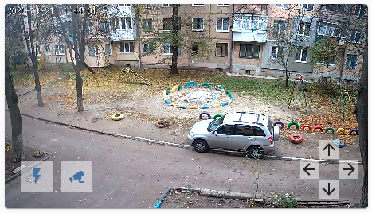

# Simple PTZ control for the China cameras ( PTZ-YCC365 )


<!-- TOC -->

- [Introduction](#introduction)
- [How to install](#how-to-install)
- [Configuration](#configuration)
- [My setup](#my-setup)

<!-- /TOC -->

## INTRODUCTION

This plugin was created for the China cameras that doesn't support ONVIF fully as required for the Home Assistant.

Plugin is post XML data directly to the camera and haven't any dependencies what is great with rapid evolution of Home Assistant.

You can use custom firmware to hack the camera and use curl commands to control Pan and Tilt. 

## HOW TO INSTALL

- The easiest way is to install it with [HACS](https://hacs.xyz/). First install [HACS](https://hacs.xyz/) if you don't have it yet. After installation need to add custom repository `https://github.com/sanyadez/PTZ-YCC365` and click install

- Alternatively, you can install it manually. Just copy paste `/custom_components/ptz_ycc365` folder in your `config/custom_components` directory.

## CONFIGURATION

To add services to the Home Assistant you need just include next code in your configuration.yaml:

```
ptz_ycc365:
```


## MY SETUP

```
camera_image: camera.outdoor
camera_view: live
elements:
  - icon: 'mdi:arrow-up'
    style:
      background: 'rgba(255, 255, 255, 0.5)'
      bottom: 50px
      right: 25px
    tap_action:
      action: call-service
      service: ptz_ycc365.move_up
      service_data:
        host: 192.168.1.21
    type: icon
  - icon: 'mdi:arrow-down'
    style:
      background: 'rgba(255, 255, 255, 0.5)'
      bottom: 0px
      right: 25px
    tap_action:
      action: call-service
      service: ptz_ycc365.move_down
      service_data:
        host: 192.168.1.21
    type: icon
  - icon: 'mdi:arrow-left'
    style:
      background: 'rgba(255, 255, 255, 0.5)'
      bottom: 25px
      right: 50px
    tap_action:
      action: call-service
      service: ptz_ycc365.move_left
      service_data:
        host: 192.168.1.21
    type: icon
  - icon: 'mdi:arrow-right'
    style:
      background: 'rgba(255, 255, 255, 0.5)'
      bottom: 25px
      right: 0px
    tap_action:
      action: call-service
      service: ptz_ycc365.move_rigth
      service_data:
        host: 192.168.1.21
    type: icon
  - entity: switch.sonoff_10005330a7
    style:
      background: 'rgba(255, 255, 255, 0.5)'
      bottom: 0px
      left: 40px
    tap_action:
      action: call-service
      service: switch.toggle
      service_data:
        entity_id: switch.sonoff_10005330a7
    type: state-icon
  - entity: camera.outdoor
    icon: 'mdi:cctv'
    style:
      background: 'rgba(255, 255, 255, 0.5)'
      bottom: 0px
      left: 90px
    tap_action:
      action: more-info
    type: state-icon
entity: camera.outdoor
tap_action:
  action: more-info
type: picture-elements
```


